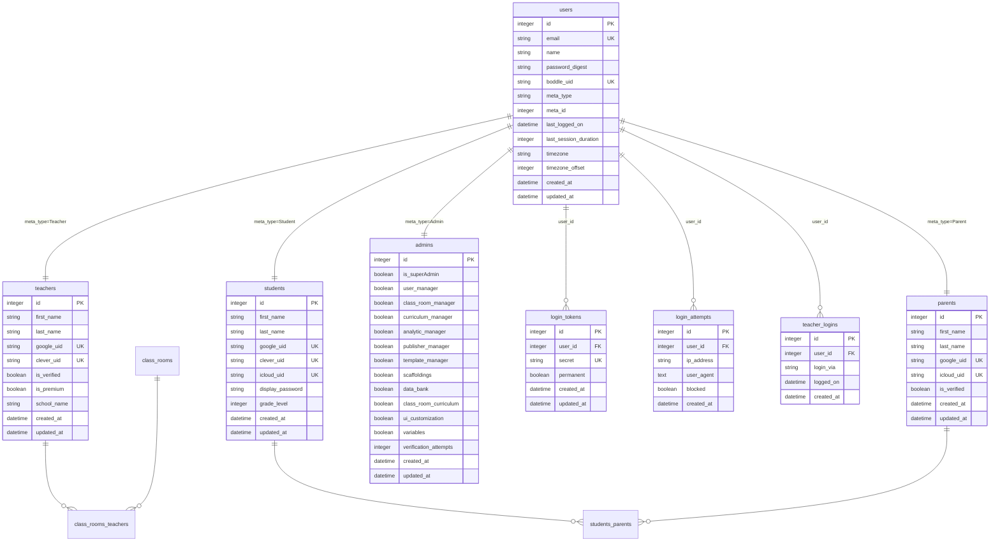

# Database Schema - Current Rails LMS

This document describes the database schema for authentication-related tables in the current Rails LMS application.

## Database Type

**PostgreSQL** (version 12+)

**Database Name**:
- Production: `lmsprod`
- Development: `boddle_development`
- Test: `boddle_test`

## Entity Relationship Diagram



## Table Schemas

### users

**Purpose**: Base authentication table for all user types (polymorphic parent)

```sql
CREATE TABLE users (
    id SERIAL PRIMARY KEY,
    email VARCHAR(255) UNIQUE NOT NULL,
    name VARCHAR(255),
    password_digest VARCHAR(255) NOT NULL,
    boddle_uid VARCHAR(255) UNIQUE,
    meta_type VARCHAR(50) NOT NULL,  -- 'Teacher', 'Student', 'Parent', 'Admin', 'Administrator'
    meta_id INTEGER NOT NULL,
    last_logged_on TIMESTAMP,
    last_session_duration INTEGER,
    timezone VARCHAR(100),
    timezone_offset INTEGER,
    created_at TIMESTAMP NOT NULL DEFAULT NOW(),
    updated_at TIMESTAMP NOT NULL DEFAULT NOW()
);

CREATE INDEX index_users_on_email ON users(email);
CREATE INDEX index_users_on_boddle_uid ON users(boddle_uid);
CREATE INDEX index_users_on_meta_type_and_meta_id ON users(meta_type, meta_id);
```

**Key Fields**:
- `email`: Unique email address (case-insensitive in queries)
- `password_digest`: bcrypt hashed password
- `boddle_uid`: UUID v4 unique identifier (generated on creation)
- `meta_type`: Polymorphic type indicator
- `meta_id`: Foreign key to specific account type table

**Polymorphic Associations**:
```ruby
# Rails model
belongs_to :meta, polymorphic: true

# Examples:
# meta_type='Teacher', meta_id=123 → teachers.id=123
# meta_type='Student', meta_id=456 → students.id=456
```

---

### teachers

**Purpose**: Teacher-specific account information

```sql
CREATE TABLE teachers (
    id SERIAL PRIMARY KEY,
    first_name VARCHAR(255),
    last_name VARCHAR(255),
    google_uid VARCHAR(255) UNIQUE,
    clever_uid VARCHAR(255) UNIQUE,
    is_verified BOOLEAN DEFAULT FALSE,
    is_premium BOOLEAN DEFAULT FALSE,
    school_name VARCHAR(255),
    organization_name VARCHAR(255),
    created_at TIMESTAMP NOT NULL DEFAULT NOW(),
    updated_at TIMESTAMP NOT NULL DEFAULT NOW()
);

CREATE INDEX index_teachers_on_google_uid ON teachers(google_uid);
CREATE INDEX index_teachers_on_clever_uid ON teachers(clever_uid);
```

**Key Fields**:
- `google_uid`: Google OAuth2 unique identifier (sub claim)
- `clever_uid`: Clever SSO unique identifier
- `is_verified`: Email verification status
- `is_premium`: Premium subscription status

**Relationships**:
```ruby
has_one :user, as: :meta, dependent: :destroy
has_many :class_rooms, through: :class_rooms_teachers
```

---

### students

**Purpose**: Student-specific account information

```sql
CREATE TABLE students (
    id SERIAL PRIMARY KEY,
    first_name VARCHAR(255),
    last_name VARCHAR(255),
    google_uid VARCHAR(255) UNIQUE,
    clever_uid VARCHAR(255) UNIQUE,
    icloud_uid VARCHAR(255) UNIQUE,
    display_password VARCHAR(50),  -- Plain text for display to teachers/parents
    grade_level INTEGER,
    avatar_url TEXT,
    created_at TIMESTAMP NOT NULL DEFAULT NOW(),
    updated_at TIMESTAMP NOT NULL DEFAULT NOW()
);

CREATE INDEX index_students_on_google_uid ON students(google_uid);
CREATE INDEX index_students_on_clever_uid ON students(clever_uid);
CREATE INDEX index_students_on_icloud_uid ON students(icloud_uid);
```

**Key Fields**:
- `google_uid`: Google OAuth2 unique identifier
- `clever_uid`: Clever SSO unique identifier
- `icloud_uid`: iCloud/Apple Sign In unique identifier
- `display_password`: Shown to teachers/parents (NOT for authentication)
- `grade_level`: K-12 grade (0=K, 1-12)

**Note**: `display_password` is for convenience only. Actual authentication uses `users.password_digest`.

**Relationships**:
```ruby
has_one :user, as: :meta, dependent: :destroy
has_many :parents, through: :students_parents
```

---

### parents

**Purpose**: Parent-specific account information

```sql
CREATE TABLE parents (
    id SERIAL PRIMARY KEY,
    first_name VARCHAR(255),
    last_name VARCHAR(255),
    google_uid VARCHAR(255) UNIQUE,
    icloud_uid VARCHAR(255) UNIQUE,
    is_verified BOOLEAN DEFAULT FALSE,
    created_at TIMESTAMP NOT NULL DEFAULT NOW(),
    updated_at TIMESTAMP NOT NULL DEFAULT NOW()
);

CREATE INDEX index_parents_on_google_uid ON parents(google_uid);
CREATE INDEX index_parents_on_icloud_uid ON parents(icloud_uid);
```

**Key Fields**:
- `google_uid`: Google OAuth2 unique identifier
- `icloud_uid`: iCloud/Apple Sign In unique identifier
- `is_verified`: Email verification status

**Relationships**:
```ruby
has_one :user, as: :meta, dependent: :destroy
has_many :students, through: :students_parents
```

---

### admins

**Purpose**: Admin-specific account information with granular permissions

```sql
CREATE TABLE admins (
    id SERIAL PRIMARY KEY,
    is_superAdmin BOOLEAN DEFAULT FALSE,
    user_manager BOOLEAN DEFAULT FALSE,
    class_room_manager BOOLEAN DEFAULT FALSE,
    curriculum_manager BOOLEAN DEFAULT FALSE,
    analytic_manager BOOLEAN DEFAULT FALSE,
    publisher_manager BOOLEAN DEFAULT FALSE,
    template_manager BOOLEAN DEFAULT FALSE,
    scaffoldings BOOLEAN DEFAULT FALSE,
    data_bank BOOLEAN DEFAULT FALSE,
    class_room_curriculum BOOLEAN DEFAULT FALSE,
    ui_customization BOOLEAN DEFAULT FALSE,
    variables BOOLEAN DEFAULT FALSE,
    verification_attempts INTEGER DEFAULT 0,
    created_at TIMESTAMP NOT NULL DEFAULT NOW(),
    updated_at TIMESTAMP NOT NULL DEFAULT NOW()
);
```

**Permission Fields**:
- `is_superAdmin`: Full system access
- `user_manager`: Can manage users
- `class_room_manager`: Can edit classrooms
- `curriculum_manager`: Can edit curriculum
- (etc.)

**2FA**:
- `verification_attempts`: Tracks failed 2FA attempts

**Relationships**:
```ruby
has_one :user, as: :meta, dependent: :destroy
```

---

### login_tokens

**Purpose**: Magic link authentication tokens for quick game access

```sql
CREATE TABLE login_tokens (
    id SERIAL PRIMARY KEY,
    user_id INTEGER NOT NULL REFERENCES users(id) ON DELETE CASCADE,
    secret VARCHAR(255) UNIQUE NOT NULL,
    permanent BOOLEAN DEFAULT FALSE,
    created_at TIMESTAMP NOT NULL DEFAULT NOW(),
    updated_at TIMESTAMP NOT NULL DEFAULT NOW()
);

CREATE INDEX index_login_tokens_on_secret ON login_tokens(secret);
CREATE INDEX index_login_tokens_on_user_id ON login_tokens(user_id);
CREATE INDEX index_login_tokens_on_created_at ON login_tokens(created_at);
```

**Key Fields**:
- `secret`: Random URL-safe token (generated with `SecureRandom.urlsafe_base64(32)`)
- `permanent`: If false, expires after 5 minutes and is deleted after use

**Usage**:
```ruby
# Generate token
token = LoginToken.create(
  user_id: student.user.id,
  secret: SecureRandom.urlsafe_base64(32),
  permanent: false
)

# Use token
url = "https://game.boddle.com/auth/token?token=#{token.secret}"
```

**Expiry Logic**:
```ruby
# Non-permanent tokens expire after 5 minutes
if !login_token.permanent? && login_token.created_at < 5.minutes.ago
  # Token expired
  login_token.destroy
end
```

---

### login_attempts

**Purpose**: Track failed login attempts for rate limiting

```sql
CREATE TABLE login_attempts (
    id SERIAL PRIMARY KEY,
    user_id INTEGER REFERENCES users(id) ON DELETE SET NULL,
    ip_address VARCHAR(45) NOT NULL,  -- Supports IPv6
    user_agent TEXT,
    blocked BOOLEAN DEFAULT FALSE,
    created_at TIMESTAMP NOT NULL DEFAULT NOW()
);

CREATE INDEX index_login_attempts_on_ip_address ON login_attempts(ip_address);
CREATE INDEX index_login_attempts_on_user_id ON login_attempts(user_id);
CREATE INDEX index_login_attempts_on_created_at ON login_attempts(created_at);
```

**Key Fields**:
- `ip_address`: Client IP address (IPv4 or IPv6)
- `user_agent`: Browser user agent string
- `blocked`: Whether this attempt was blocked

**Rate Limiting Query**:
```sql
-- Count recent attempts from IP
SELECT COUNT(*) FROM login_attempts
WHERE ip_address = '192.168.1.1'
  AND created_at > NOW() - INTERVAL '10 minutes';

-- If count >= 5, check if lockout expired
-- Lockout expires after 15 minutes from last attempt
```

---

### teacher_logins

**Purpose**: Audit trail of teacher login events

```sql
CREATE TABLE teacher_logins (
    id SERIAL PRIMARY KEY,
    user_id INTEGER NOT NULL REFERENCES users(id) ON DELETE CASCADE,
    login_via VARCHAR(20),  -- 'EMAIL', 'GOOGLE', 'CLEVER'
    logged_on TIMESTAMP NOT NULL,
    created_at TIMESTAMP NOT NULL DEFAULT NOW()
);

CREATE INDEX index_teacher_logins_on_user_id ON teacher_logins(user_id);
CREATE INDEX index_teacher_logins_on_logged_on ON teacher_logins(logged_on);
```

**Key Fields**:
- `login_via`: Authentication method used
  - `EMAIL`: Email/password
  - `GOOGLE`: Google OAuth2
  - `CLEVER`: Clever SSO

**Usage**:
```ruby
TeacherLogin.create(
  user_id: teacher.user.id,
  login_via: TeacherLogin::LOGIN_VIA_GOOGLE,
  logged_on: Time.current
)
```

---

## Join Tables

### class_rooms_teachers

**Purpose**: Many-to-many relationship between teachers and classrooms

```sql
CREATE TABLE class_rooms_teachers (
    id SERIAL PRIMARY KEY,
    class_room_id INTEGER NOT NULL REFERENCES class_rooms(id) ON DELETE CASCADE,
    teacher_id INTEGER NOT NULL REFERENCES teachers(id) ON DELETE CASCADE,
    created_at TIMESTAMP NOT NULL DEFAULT NOW()
);

CREATE INDEX index_class_rooms_teachers_on_class_room_id ON class_rooms_teachers(class_room_id);
CREATE INDEX index_class_rooms_teachers_on_teacher_id ON class_rooms_teachers(teacher_id);
CREATE UNIQUE INDEX index_class_rooms_teachers_unique ON class_rooms_teachers(class_room_id, teacher_id);
```

---

### students_parents

**Purpose**: Many-to-many relationship between students and parents

```sql
CREATE TABLE students_parents (
    id SERIAL PRIMARY KEY,
    student_id INTEGER NOT NULL REFERENCES students(id) ON DELETE CASCADE,
    parent_id INTEGER NOT NULL REFERENCES parents(id) ON DELETE CASCADE,
    created_at TIMESTAMP NOT NULL DEFAULT NOW()
);

CREATE INDEX index_students_parents_on_student_id ON students_parents(student_id);
CREATE INDEX index_students_parents_on_parent_id ON students_parents(parent_id);
CREATE UNIQUE INDEX index_students_parents_unique ON students_parents(student_id, parent_id);
```

---

## Data Integrity Constraints

### Unique Constraints

- `users.email` - No duplicate emails
- `users.boddle_uid` - No duplicate Boddle UIDs
- `teachers.google_uid` - One Google account per teacher
- `teachers.clever_uid` - One Clever account per teacher
- `students.google_uid` - One Google account per student
- `students.clever_uid` - One Clever account per student
- `students.icloud_uid` - One iCloud account per student
- `parents.google_uid` - One Google account per parent
- `parents.icloud_uid` - One iCloud account per parent
- `login_tokens.secret` - Unique login token secrets

### Foreign Key Constraints

- `users.meta_id` → `teachers/students/parents/admins.id` (polymorphic, NOT enforced by DB)
- `login_tokens.user_id` → `users.id` (CASCADE DELETE)
- `login_attempts.user_id` → `users.id` (SET NULL on delete)
- `teacher_logins.user_id` → `users.id` (CASCADE DELETE)

### Check Constraints

```sql
-- Ensure meta_type is valid
ALTER TABLE users ADD CONSTRAINT check_meta_type
CHECK (meta_type IN ('Teacher', 'Student', 'Parent', 'Admin', 'Administrator'));

-- Ensure grade_level is valid (K-12)
ALTER TABLE students ADD CONSTRAINT check_grade_level
CHECK (grade_level >= 0 AND grade_level <= 12);
```

---

## Example Queries

### Find User by Email (Case-Insensitive)

```sql
SELECT * FROM users WHERE LOWER(email) = LOWER('teacher@example.com');
```

### Find Teacher with OAuth UID

```sql
SELECT u.*, t.*
FROM users u
INNER JOIN teachers t ON u.meta_id = t.id AND u.meta_type = 'Teacher'
WHERE t.google_uid = 'google-oauth-id-12345';
```

### Check Rate Limiting

```sql
-- Count recent failed attempts
SELECT COUNT(*) FROM login_attempts
WHERE ip_address = '192.168.1.100'
  AND created_at > NOW() - INTERVAL '10 minutes';

-- Check if lockout period expired
SELECT MAX(created_at) FROM login_attempts
WHERE ip_address = '192.168.1.100'
HAVING MAX(created_at) > NOW() - INTERVAL '15 minutes';
```

### Find Active Login Tokens

```sql
-- Non-permanent tokens created in last 5 minutes
SELECT * FROM login_tokens
WHERE permanent = FALSE
  AND created_at > NOW() - INTERVAL '5 minutes';

-- Permanent tokens (always valid)
SELECT * FROM login_tokens WHERE permanent = TRUE;
```

### Get Teacher's Classrooms

```sql
SELECT cr.*
FROM class_rooms cr
INNER JOIN class_rooms_teachers crt ON cr.id = crt.class_room_id
INNER JOIN teachers t ON crt.teacher_id = t.id
INNER JOIN users u ON u.meta_id = t.id AND u.meta_type = 'Teacher'
WHERE u.email = 'teacher@example.com';
```

---

## Migration Considerations

### No Schema Changes Required

The Go authentication gateway will use the **exact same tables** as Rails, ensuring zero-downtime migration.

### New Tables for Go Gateway (Optional)

If implementing refresh tokens:

```sql
CREATE TABLE refresh_tokens (
    id SERIAL PRIMARY KEY,
    user_id INTEGER NOT NULL REFERENCES users(id) ON DELETE CASCADE,
    token TEXT NOT NULL UNIQUE,
    expires_at TIMESTAMP NOT NULL,
    created_at TIMESTAMP NOT NULL DEFAULT NOW(),
    revoked BOOLEAN DEFAULT FALSE,
    ip_address VARCHAR(45),
    user_agent TEXT
);

CREATE INDEX index_refresh_tokens_on_token ON refresh_tokens(token);
CREATE INDEX index_refresh_tokens_on_user_id ON refresh_tokens(user_id);
CREATE INDEX index_refresh_tokens_on_expires_at ON refresh_tokens(expires_at);
```

This table would be managed exclusively by the Go gateway.

---

## Database Connection

### Rails Configuration

```ruby
# config/database.yml
production:
  adapter: postgresql
  encoding: unicode
  pool: <%= ENV.fetch("RAILS_MAX_THREADS") { 5 } %>
  database: <%= ENV.fetch("DB_NAME") { "lmsprod" } %>
  username: <%= ENV.fetch("DB_USER") %>
  password: <%= ENV.fetch("DB_PASSWORD") %>
  host: <%= ENV.fetch("DB_HOST") { "localhost" } %>
  port: <%= ENV.fetch("DB_PORT") { 5432 } %>
```

### Go Gateway Configuration (Future)

```go
// Connection string format
connStr := fmt.Sprintf(
    "host=%s port=%d user=%s password=%s dbname=%s sslmode=%s",
    cfg.DB.Host,
    cfg.DB.Port,
    cfg.DB.User,
    cfg.DB.Password,
    cfg.DB.Name,
    cfg.DB.SSLMode,
)
```

Both Rails and Go will connect to the **same database** with **shared read/write access**.
