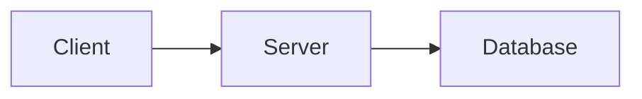

# Diagram Generation Guide

This directory contains architecture diagrams in Mermaid format (`.mmd` files) that can be rendered as images.

## Diagram Files

1. **`system-architecture.mmd`** - Complete system architecture
   - High-level architecture with all components
   - Network flow diagrams
   - Data flow architecture

2. **`deployment-architecture.mmd`** - Deployment configurations
   - Kubernetes deployment
   - AWS deployment architecture
   - Docker Compose for development

3. **`database-architecture.mmd`** - Database design
   - Entity Relationship Diagram (ERD)
   - Database sharding strategy
   - Connection pooling architecture
   - Backup and disaster recovery
   - Data retention and archival

4. **`monitoring-observability.mmd`** - Monitoring stack
   - Monitoring architecture
   - Grafana dashboard layouts
   - Alert rules and SLOs
   - Distributed tracing flow
   - Log aggregation
   - Health check architecture

5. **`current-system-flows.md`** - Current Rails auth flows (Markdown with embedded Mermaid)

6. **`new-system-flows.md`** - New Go Gateway flows (Markdown with embedded Mermaid)

## Viewing Diagrams

### Option 1: GitHub/GitLab (Easiest)

GitHub and GitLab automatically render Mermaid diagrams. Just view the `.md` files:

- [current-system-flows.md](./current-system-flows.md)
- [new-system-flows.md](./new-system-flows.md)

For `.mmd` files, view them using GitHub's Mermaid Live Editor:
https://mermaid.live/

### Option 2: VS Code Extension

Install the Mermaid extension:
```bash
code --install-extension bierner.markdown-mermaid
```

Then open any `.md` or `.mmd` file and click "Preview".

### Option 3: Generate PNG/SVG Images

#### Install mermaid-cli

```bash
# Using npm
npm install -g @mermaid-js/mermaid-cli

# Using yarn
yarn global add @mermaid-js/mermaid-cli

# Using homebrew (macOS)
brew install mermaid-cli
```

#### Generate Images

Run the provided script:

```bash
./scripts/generate-diagrams.sh
```

This will:
1. Convert all `.mmd` files to PNG and SVG
2. Save images to `docs/diagrams/images/`
3. Create an HTML preview page

**Output:**
```
docs/diagrams/images/
├── system-architecture.png
├── system-architecture.svg
├── deployment-architecture.png
├── deployment-architecture.svg
├── database-architecture.png
├── database-architecture.svg
├── monitoring-observability.png
├── monitoring-observability.svg
└── index.html  (preview all diagrams)
```

#### View Generated Images

```bash
open docs/diagrams/images/index.html
```

Or open individual images:
```bash
open docs/diagrams/images/system-architecture.png
```

### Option 4: Online Mermaid Editor

1. Go to https://mermaid.live/
2. Copy the content of any `.mmd` file
3. Paste into the editor
4. Download as PNG or SVG

### Option 5: Manual Command (Advanced)

Generate a specific diagram:

```bash
# PNG with transparent background
mmdc -i docs/diagrams/system-architecture.mmd \
     -o system-architecture.png \
     -b transparent \
     -w 1920 -H 1080

# SVG (vector format)
mmdc -i docs/diagrams/system-architecture.mmd \
     -o system-architecture.svg \
     -b transparent

# PDF (for documentation)
mmdc -i docs/diagrams/system-architecture.mmd \
     -o system-architecture.pdf
```

## Customizing Diagrams

### Theme Configuration

Create a custom theme file `mermaid-config.json`:

```json
{
  "theme": "default",
  "themeVariables": {
    "primaryColor": "#c8e6c9",
    "primaryTextColor": "#000",
    "primaryBorderColor": "#7C0000",
    "lineColor": "#333",
    "secondaryColor": "#e1f5fe",
    "tertiaryColor": "#fff9c4"
  }
}
```

Use it:
```bash
mmdc -i diagram.mmd -o output.png -c mermaid-config.json
```

### High-Resolution Images

For presentations or printing:

```bash
mmdc -i diagram.mmd \
     -o diagram-hires.png \
     -w 3840 -H 2160 \
     -b white \
     -s 2  # Scale factor
```

## Diagram Categories

### 📊 System Architecture
- Complete system overview
- Component relationships
- Data flows
- Network topology

### 🚀 Deployment
- Kubernetes manifests
- AWS infrastructure
- Container orchestration
- Scaling strategies

### 🗄️ Database
- Schema design
- Relationships (ERD)
- Replication topology
- Backup strategies
- Performance optimization

### 📈 Monitoring
- Metrics collection
- Dashboard layouts
- Alert rules
- Log aggregation
- Tracing

### 🔐 Authentication Flows
- Current Rails flows
- New Go Gateway flows
- Sequence diagrams
- Security features

## Embedding in Documentation

### Markdown Files

```markdown
# My Architecture


\`\`\`
```

### HTML Files

```html
<div class="mermaid">
graph LR
    A[Client] --> B[Server]
    B --> C[Database]
</div>

<script src="https://cdn.jsdelivr.net/npm/mermaid/dist/mermaid.min.js"></script>
<script>mermaid.initialize({startOnLoad:true});</script>
```

### Confluence / Jira

Use the Mermaid Diagrams plugin:
1. Install "Mermaid Diagrams for Confluence"
2. Insert macro: `/mermaid`
3. Paste diagram code

### Notion

Notion doesn't support Mermaid natively. Options:
1. Export as PNG and upload
2. Use the Mermaid Live Editor link
3. Embed as code block with language `mermaid`

## Troubleshooting

### Error: "Puppeteer old Headless mode"

Update mermaid-cli:
```bash
npm update -g @mermaid-js/mermaid-cli
```

### Error: "Cannot find Chrome"

Install Chromium:
```bash
# macOS
brew install chromium

# Ubuntu/Debian
sudo apt-get install chromium-browser

# Set environment variable
export PUPPETEER_EXECUTABLE_PATH=/usr/bin/chromium-browser
```

### Diagram Too Large

Split into multiple diagrams or reduce detail level.

### Colors Not Showing

Make sure you're using compatible themes and proper styling in Mermaid syntax.

## Resources

- **Mermaid Documentation**: https://mermaid.js.org/
- **Mermaid Live Editor**: https://mermaid.live/
- **Mermaid CLI Docs**: https://github.com/mermaid-js/mermaid-cli
- **Syntax Reference**: https://mermaid.js.org/intro/syntax-reference.html
- **Examples Gallery**: https://mermaid.js.org/ecosystem/integrations.html

## Contributing

When adding new diagrams:

1. Create `.mmd` file in `docs/diagrams/`
2. Follow naming convention: `lowercase-with-dashes.mmd`
3. Add description to this README
4. Test rendering with `./scripts/generate-diagrams.sh`
5. Commit both `.mmd` source and generated images

## License

These diagrams are part of the Boddle Authentication Gateway project.
