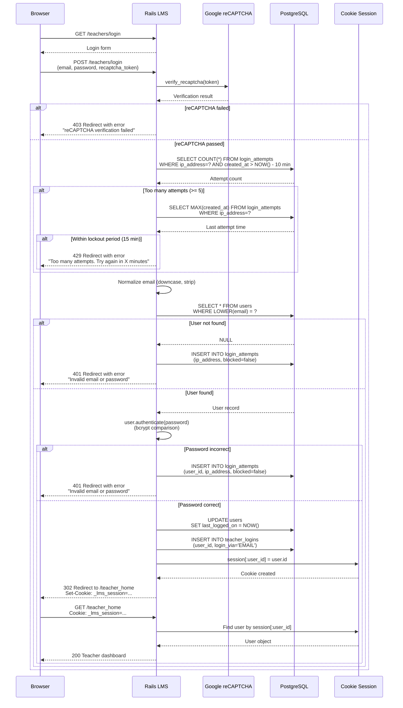
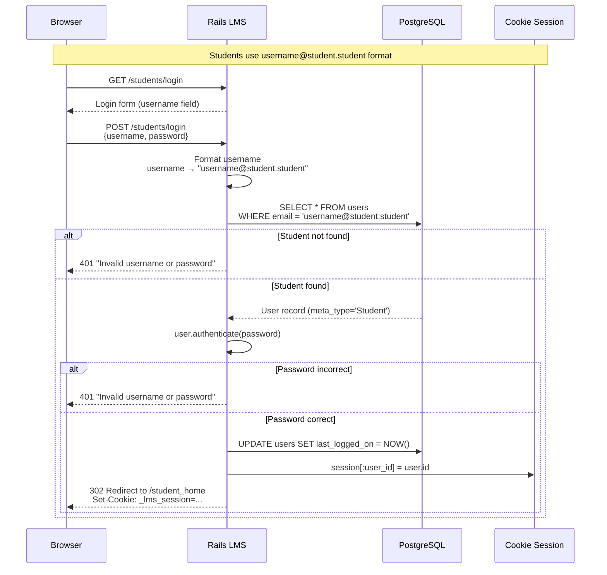
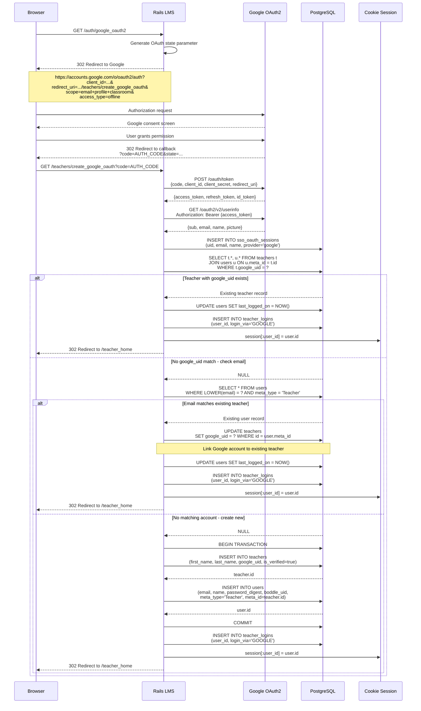
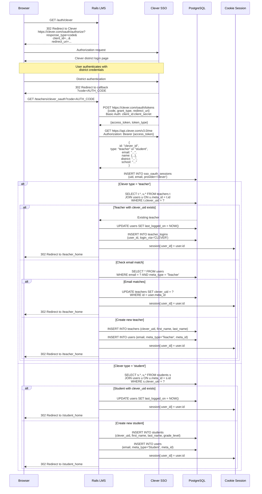
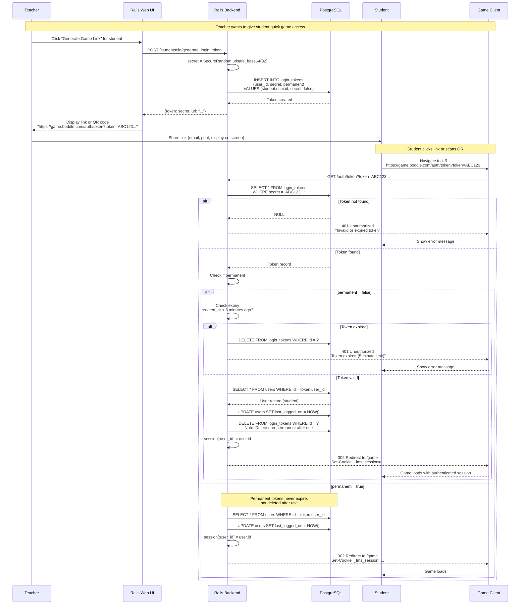
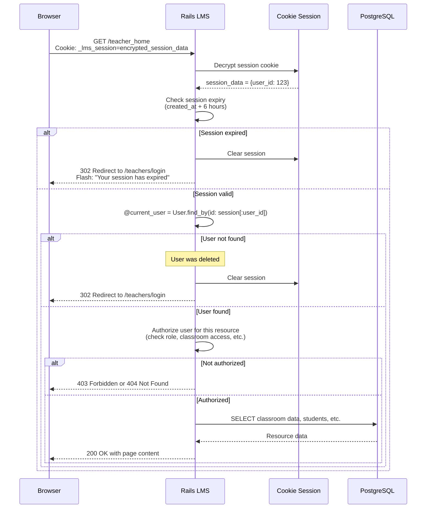
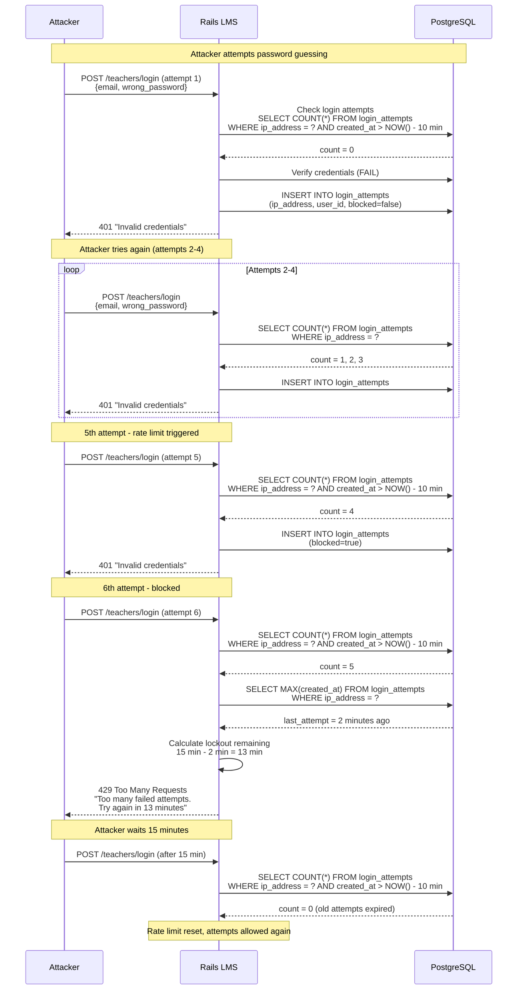

# Current System Authentication Flow Diagrams

This document contains detailed sequence diagrams showing how authentication currently works in the Rails LMS application.

## Table of Contents

1. [Email/Password Login Flow](#emailpassword-login-flow)
2. [Google OAuth2 Flow](#google-oauth2-flow)
3. [Clever SSO Flow](#clever-sso-flow)
4. [Login Token (Magic Link) Flow](#login-token-magic-link-flow)
5. [Session Validation Flow](#session-validation-flow)
6. [Rate Limiting Flow](#rate-limiting-flow)

---

## Email/Password Login Flow

### Teacher/Parent Login



**Key Files**:
- Controller: `app/controllers/teachers_controller.rb:768`
- Model: `app/models/user.rb`
- Helper: `app/helpers/admins_helper.rb#log_in`

**Security Features**:
1. **reCAPTCHA v3**: Bot protection
2. **Rate Limiting**: 5 attempts per 10 minutes
3. **Lockout**: 15-minute lockout after 5 failed attempts
4. **Case-insensitive email**: Normalized to lowercase
5. **bcrypt**: Password hashed with cost factor 10
6. **Audit trail**: `login_attempts` and `teacher_logins` tables

**Session Cookie**:
- **Name**: `_lms_session`
- **Expiry**: 6 hours
- **Secure**: Yes (production only)
- **HttpOnly**: Yes
- **SameSite**: Lax

---

### Student Login



**Key Differences from Teacher Login**:
- No reCAPTCHA required
- No rate limiting (students don't have email-based attack vector)
- Username format: `username@student.student`
- Simpler password requirements (minimum 3 characters vs 8)

---

## Google OAuth2 Flow

### Teacher OAuth Login



**Configuration**: `config/initializers/omniauth.rb`

```ruby
provider :google_oauth2,
  ENV['GOOGLE_CLIENT_ID'],
  ENV['GOOGLE_CLIENT_SECRET'],
  {
    scope: 'userinfo.email, profile, https://www.googleapis.com/auth/classroom.courses.readonly',
    access_type: 'offline',
    prompt: 'consent'
  }
```

**OAuth Scopes**:
- `userinfo.email` - User's email address
- `profile` - User's name and profile picture
- `classroom.courses.readonly` - Read Google Classroom courses (for teachers)

**Access Type**: `offline` - Provides refresh token for long-term access

**Account Matching Logic**:
1. **Priority 1**: Match by `teachers.google_uid` (direct OAuth link)
2. **Priority 2**: Match by email (link OAuth to existing account)
3. **Priority 3**: Create new teacher account

**Stored Data**:
- `teachers.google_uid` - Google's unique identifier (`sub` claim from JWT)
- `sso_oauth_sessions` - Temporary session data during OAuth flow

---

## Clever SSO Flow

### District-Level SSO for K-12 Schools



**Key Features**:
- **Roster Auto-Provisioning**: Students and teachers auto-created from Clever roster
- **District-Level**: Single sign-on for entire school district
- **Role Detection**: Clever provides `type` field (teacher vs student)
- **Rich Metadata**: Includes district, school, section information
- **Premium Licenses**: Clever can manage premium license allocation

**Clever API Data**:
```json
{
  "data": {
    "id": "589c5bc0ace351ab11000001",
    "type": "teacher",
    "email": "teacher@district.edu",
    "name": {
      "first": "John",
      "last": "Smith"
    },
    "district": "589c5bc0ace351ab11000000",
    "schools": ["589c5bc0ace351ab11000002"]
  }
}
```

**Controller**: `app/controllers/teachers_controller.rb:344-410`

---

## Login Token (Magic Link) Flow

### Teacher Generates Link for Student



**Token Types**:

| Type | Expiry | Reusable | Use Case |
|------|--------|----------|----------|
| **Temporary** | 5 minutes | No (deleted after use) | Quick classroom access |
| **Permanent** | Never | Yes | Deep links in apps, bookmarks |

**Model**: `app/models/login_token.rb`

**Security Considerations**:
- **Random secret**: 32-byte URL-safe base64 (256 bits of entropy)
- **Short expiry**: 5 minutes for temporary tokens
- **Single use**: Temporary tokens deleted after authentication
- **No password**: Student doesn't need to enter password

**Use Cases**:
1. **Classroom Quick Start**: Teacher displays QR code on projector, students scan to join
2. **Homework Links**: Teacher emails magic link to students
3. **Parent Access**: Parent gets temporary link to view child's progress
4. **Game Deep Links**: Permanent tokens for direct game access

---

## Session Validation Flow

### Every Protected Request



**Session Helper**: `app/helpers/admins_helper.rb`

```ruby
def current_user
  @current_user ||= User.find_by(id: session[:user_id])
end

def logged_in?
  !current_user.nil?
end

def require_login
  unless logged_in?
    redirect_to login_path
  end
end
```

**Session Configuration**: `config/initializers/session_store.rb`

```ruby
Rails.application.config.session_store :cookie_store,
  key: '_lms_session',
  expire_after: 6.hours,
  secure: Rails.env.production?,
  httponly: true,
  same_site: :lax
```

**Authorization Example**:

```ruby
# app/controllers/class_rooms_controller.rb
before_action :require_login
before_action :check_classroom_access, only: [:show, :edit, :update]

def check_classroom_access
  @class_room = ClassRoom.find(params[:id])

  if current_user.is_teacher?
    teacher = Teacher.find(current_user.meta_id)
    unless teacher.class_room_allowed?(@class_room.id)
      render_404
    end
  elsif current_user.is_student?
    # Students can only access their assigned classroom
    unless @class_room.students.include?(current_user.meta)
      render_404
    end
  else
    render_404
  end
end
```

---

## Rate Limiting Flow

### Failed Login Protection



**Rate Limiting Rules**:
- **Attempt Window**: 10 minutes (rolling window)
- **Attempt Limit**: 5 failed attempts
- **Lockout Duration**: 15 minutes from last attempt
- **Tracking**: By IP address + email combination

**Model**: `app/models/login_attempt.rb`

**Query Logic**:

```ruby
# Check if IP is blocked
def self.is_blocked?(ip, email)
  # Count attempts in last 10 minutes
  attempts = where(ip_address: ip)
    .where('created_at > ?', 10.minutes.ago)
    .count

  # If 5 or more attempts, check lockout
  if attempts >= 5
    last_attempt = where(ip_address: ip)
      .order(created_at: :desc)
      .first

    # Blocked if last attempt was within 15 minutes
    return last_attempt.created_at > 15.minutes.ago
  end

  false
end
```

**Cleanup Job**: Old login attempts should be purged periodically

```ruby
# Remove attempts older than 24 hours
LoginAttempt.where('created_at < ?', 24.hours.ago).delete_all
```

---

## Summary: Current System Limitations

### Identified Issues

1. **Cookie-based sessions**:
   - Don't work across different domains
   - Require session affinity for load balancing
   - Difficult for mobile apps to manage

2. **Multiple auth mechanisms**:
   - Web UI uses sessions
   - Game uses login tokens
   - API uses IP-based access control
   - Inconsistent security models

3. **Database-dependent rate limiting**:
   - Every login check requires DB query
   - Slow for high-traffic scenarios
   - Can't easily block by IP across multiple app servers

4. **Tight coupling**:
   - Authentication logic embedded in controllers
   - Difficult to extract or reuse
   - Can't easily add new authentication methods

5. **No token revocation**:
   - Sessions only expire after 6 hours
   - No way to force logout across devices
   - No centralized session management

6. **Scaling challenges**:
   - Cookie sessions require sticky sessions
   - Can't easily distribute authentication
   - Hard to add new services that need auth

### What Needs to Change

These flows will be replaced by the Go Authentication Gateway, which will:
- Issue JWTs instead of session cookies
- Centralize all authentication logic
- Use Redis for fast rate limiting
- Provide token revocation (blacklist)
- Enable stateless authentication
- Support easy horizontal scaling

See [New System Authentication Flows](../diagrams/new-system-flows.md) for the planned implementation.
