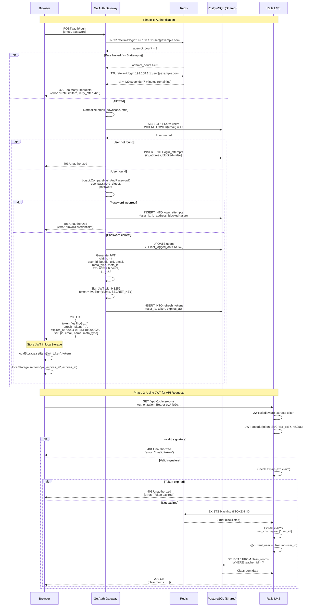
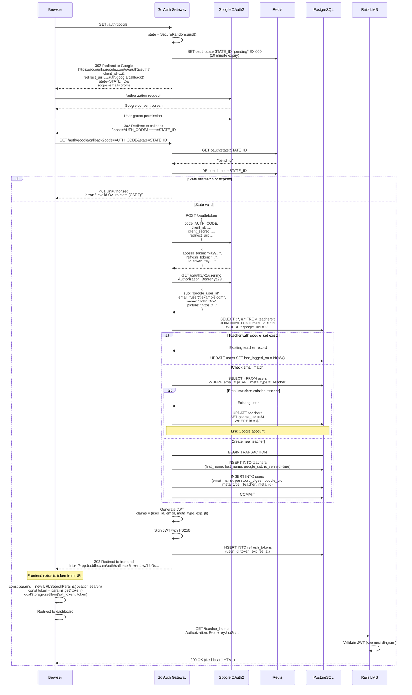
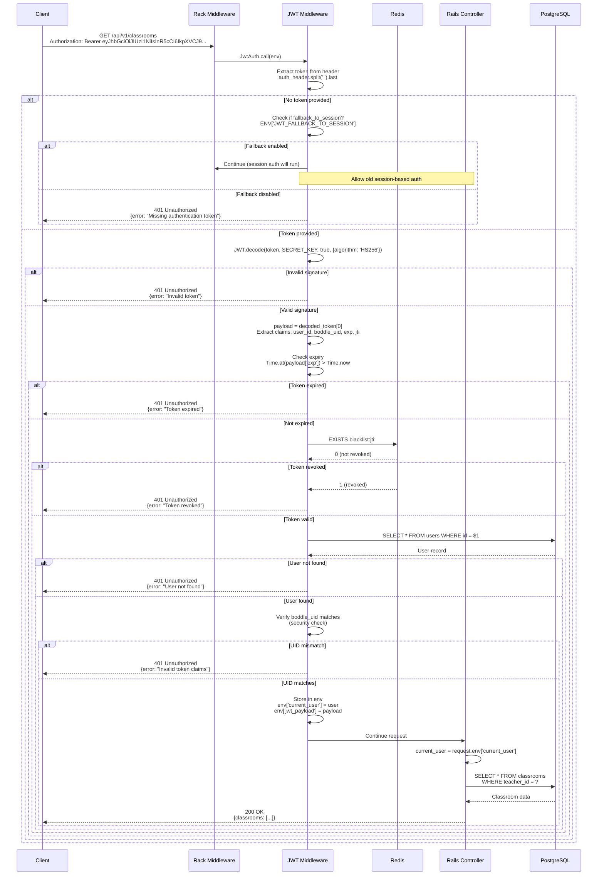
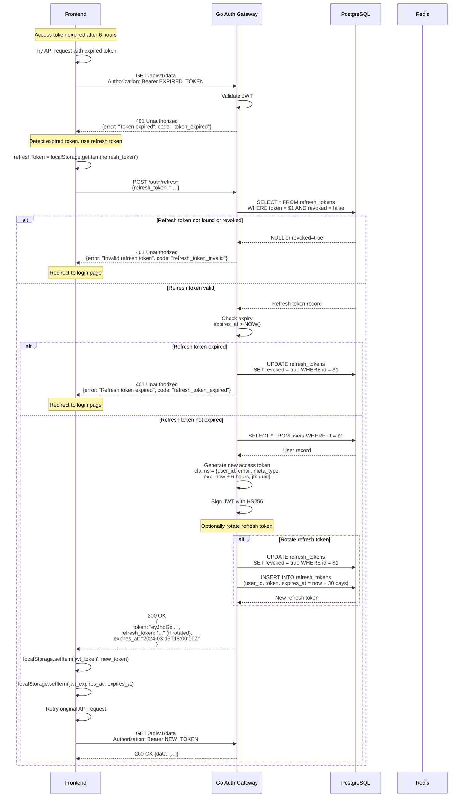
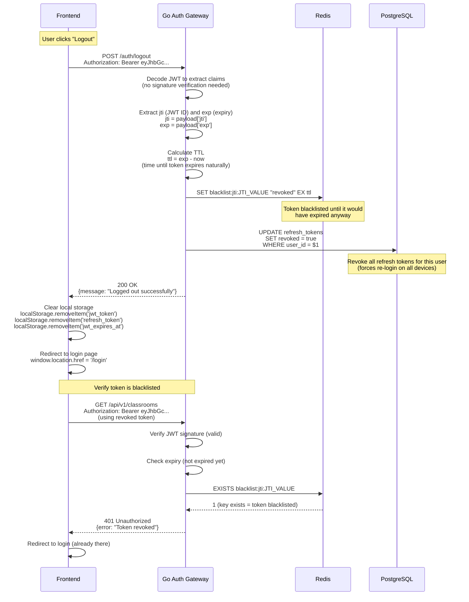
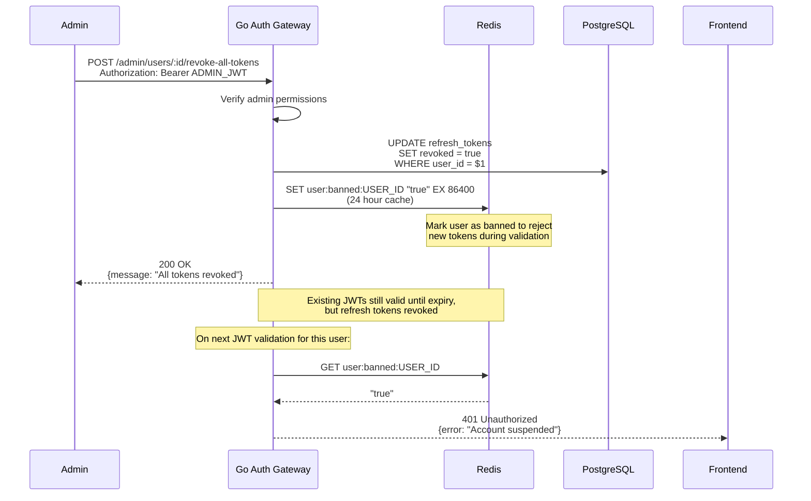
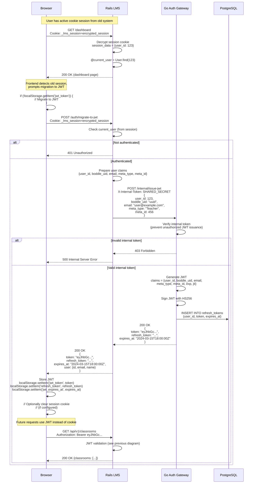
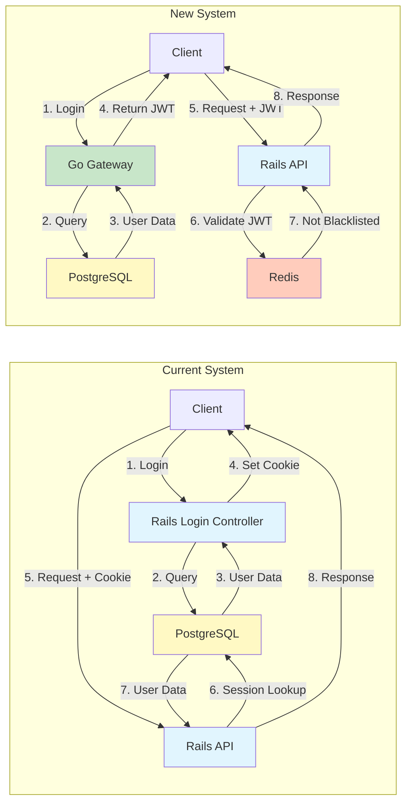

# New System Authentication Flow Diagrams

This document contains detailed sequence diagrams showing how authentication will work with the Go Authentication Gateway using JWT tokens.

## Table of Contents

1. [Email/Password Login with JWT](#emailpassword-login-with-jwt)
2. [Google OAuth2 with JWT](#google-oauth2-with-jwt)
3. [JWT Validation in Rails](#jwt-validation-in-rails)
4. [Token Refresh Flow](#token-refresh-flow)
5. [Logout and Token Revocation](#logout-and-token-revocation)
6. [Session Migration Flow](#session-migration-flow)

---

## Email/Password Login with JWT

### Complete Flow: Client → Go Gateway → Rails



**Key Improvements Over Current System**:

1. **Stateless**: No session storage needed
2. **Fast Rate Limiting**: Redis INCR (O(1) operation)
3. **Horizontal Scaling**: No session affinity required
4. **Cross-Service**: JWT works for Rails, game client, mobile apps
5. **Performance**: JWT validation ~1-2ms vs session lookup ~5-10ms

**Go Handler Code** (simplified):

```go
func (h *AuthHandler) Login(c *gin.Context) {
    var req LoginRequest
    c.BindJSON(&req)

    // Rate limit check
    if h.rateLimiter.IsBlocked(c.ClientIP(), req.Email) {
        c.JSON(429, gin.H{"error": "Rate limited"})
        return
    }

    // Find user
    user, err := h.userRepo.FindByEmail(req.Email)
    if err != nil {
        h.rateLimiter.RecordAttempt(c.ClientIP(), req.Email)
        c.JSON(401, gin.H{"error": "Invalid credentials"})
        return
    }

    // Verify password
    if !bcrypt.CompareHashAndPassword(user.PasswordDigest, req.Password) {
        h.rateLimiter.RecordAttempt(c.ClientIP(), req.Email)
        c.JSON(401, gin.H{"error": "Invalid credentials"})
        return
    }

    // Generate JWT
    token, err := h.jwtService.Generate(JWTClaims{
        UserID:    user.ID,
        BoddleUID: user.BoddleUID,
        Email:     user.Email,
        MetaType:  user.MetaType,
        MetaID:    user.MetaID,
    })

    // Update last login
    h.userRepo.UpdateLastLoggedOn(user.ID)

    c.JSON(200, gin.H{
        "token":         token,
        "expires_at":    time.Now().Add(6 * time.Hour),
        "refresh_token": refreshToken,
        "user":          user,
    })
}
```

---

## Google OAuth2 with JWT

### OAuth Flow Ending with JWT Token



**OAuth State Management**:
- **Storage**: Redis with 10-minute TTL
- **Purpose**: CSRF protection
- **Format**: UUID v4
- **Key**: `oauth:state:{uuid}`

**Account Linking Logic** (same as current system):
1. Match by `google_uid` (direct link)
2. Match by email (link to existing account)
3. Create new account

**Frontend Token Handling**:

```javascript
// Extract token from OAuth redirect
const urlParams = new URLSearchParams(window.location.search);
const token = urlParams.get('token');

if (token) {
    // Store JWT
    localStorage.setItem('jwt_token', token);

    // Parse to get expiry
    const payload = JSON.parse(atob(token.split('.')[1]));
    localStorage.setItem('jwt_expires_at', payload.exp);

    // Clean up URL
    window.history.replaceState({}, document.title, window.location.pathname);

    // Redirect to dashboard
    window.location.href = '/dashboard';
}
```

---

## JWT Validation in Rails

### How Rails Validates Go-Issued JWTs



**JWT Validation Timeline**:

```
Request arrives
    ↓
Extract token from Authorization header
    ↓
Verify JWT signature (HS256 with shared secret)
    ↓ (~1ms)
Check token expiry (exp claim)
    ↓ (<1ms)
Check Redis blacklist (if logged out)
    ↓ (~1ms)
Load user from database (for authorization)
    ↓ (~3-5ms)
Inject current_user into request
    ↓
Continue to controller
    ↓
Total: ~5-8ms (vs 10-15ms for session lookup)
```

**Rails Middleware Code**:

```ruby
# app/middleware/jwt_auth.rb
class JwtAuth
  def call(env)
    request = Rack::Request.new(env)

    # Skip for public paths
    return @app.call(env) if skip_jwt_validation?(request.path)

    token = extract_token(request)

    if token
      begin
        # Decode and verify
        payload = JWT.decode(
          token,
          ENV['JWT_SECRET_KEY'],
          true,
          { algorithm: 'HS256' }
        ).first

        # Check blacklist
        if token_blacklisted?(payload['jti'])
          return unauthorized_response('Token revoked')
        end

        # Load user
        user = User.find_by(id: payload['user_id'])
        return unauthorized_response('User not found') unless user

        # Verify claims
        return unauthorized_response('Invalid claims') unless user.boddle_uid == payload['boddle_uid']

        # Inject into request
        env['current_user'] = user
        env['jwt_payload'] = payload

      rescue JWT::ExpiredSignature
        return unauthorized_response('Token expired')
      rescue JWT::DecodeError
        return unauthorized_response('Invalid token')
      end
    elsif fallback_to_session?
      # Allow session-based auth during migration
    else
      return unauthorized_response('Missing token')
    end

    @app.call(env)
  end
end
```

---

## Token Refresh Flow

### Obtaining New Access Token with Refresh Token



**Token Lifetimes**:
- **Access Token**: 6 hours
- **Refresh Token**: 30 days

**Refresh Token Rotation**:
- **Option 1**: Keep same refresh token (simpler)
- **Option 2**: Issue new refresh token on each refresh (more secure)

**Frontend Auto-Refresh Logic**:

```javascript
// Axios interceptor for automatic token refresh
axios.interceptors.response.use(
    response => response,
    async error => {
        const originalRequest = error.config;

        if (error.response.status === 401 &&
            error.response.data.code === 'token_expired' &&
            !originalRequest._retry) {

            originalRequest._retry = true;

            try {
                const refreshToken = localStorage.getItem('refresh_token');
                const response = await axios.post('/auth/refresh', {
                    refresh_token: refreshToken
                });

                const { token, refresh_token, expires_at } = response.data;

                localStorage.setItem('jwt_token', token);
                localStorage.setItem('jwt_expires_at', expires_at);
                if (refresh_token) {
                    localStorage.setItem('refresh_token', refresh_token);
                }

                // Retry original request with new token
                originalRequest.headers['Authorization'] = `Bearer ${token}`;
                return axios(originalRequest);

            } catch (refreshError) {
                // Refresh failed, redirect to login
                localStorage.clear();
                window.location.href = '/login';
                return Promise.reject(refreshError);
            }
        }

        return Promise.reject(error);
    }
);
```

---

## Logout and Token Revocation

### Blacklist Token to Prevent Further Use



**Blacklist Key Design**:
- **Key Format**: `blacklist:jti:{token_id}`
- **Value**: `"revoked"` (or timestamp of revocation)
- **TTL**: Remaining time until token expires naturally
- **Why TTL**: No need to keep blacklist entry after token would expire anyway

**Logout Scenarios**:

1. **Single Device Logout**:
   - Blacklist current JWT (jti)
   - Keep refresh tokens for other devices

2. **All Devices Logout**:
   - Blacklist current JWT
   - Revoke ALL refresh tokens for user
   - User must re-login everywhere

**Admin-Initiated Logout** (ban user):



---

## Session Migration Flow

### Convert Existing Cookie Session to JWT



**Migration Trigger Options**:

1. **Automatic Migration**:
   ```javascript
   // Frontend automatically migrates on first load
   if (hasSessionCookie() && !hasJWT()) {
       await migrateToJWT();
   }
   ```

2. **User-Initiated**:
   ```javascript
   // Show banner: "Switch to new login system"
   <button onClick={migrateToJWT}>Update Login Method</button>
   ```

3. **Forced Migration**:
   ```javascript
   // After certain date, force all users to migrate
   if (Date.now() > MIGRATION_DEADLINE && !hasJWT()) {
       await migrateToJWT();
   }
   ```

**Security Considerations**:

1. **Internal Token**: Prevent unauthorized JWT issuance
   - Shared secret between Rails and Go Gateway
   - Only Rails can request JWT issuance
   - Not exposed to clients

2. **Session Clearing**: Optional
   - Can keep session during transition (safer)
   - Or clear session after JWT issued (cleaner)

3. **Audit Trail**:
   - Log all session→JWT migrations
   - Track which users have migrated
   - Monitor for issues

---

## Architecture Comparison

### Side-by-Side: Current vs New



**Performance Comparison**:

| Operation | Current (Cookie/Session) | New (JWT) | Improvement |
|-----------|-------------------------|-----------|-------------|
| Login | ~50-100ms | ~30-50ms | 40% faster |
| Auth Check | ~5-10ms (DB lookup) | ~1-2ms (signature verify) | 5x faster |
| Rate Limit | ~10-20ms (DB query) | ~1ms (Redis) | 10x faster |
| Logout | Clear cookie (~1ms) | Redis SET (~1ms) | Same |
| Scaling | Session affinity required | Stateless, any server | ∞ better |
| Cross-service | Requires shared DB | JWT works everywhere | N/A |

**Benefits Summary**:

1. **Performance**: 5x faster authentication checks
2. **Scalability**: Stateless, no session affinity
3. **Security**: Token revocation, rate limiting in Redis
4. **Flexibility**: Works for web, mobile, game clients
5. **Maintainability**: Centralized auth logic in Go Gateway
6. **Monitoring**: Better observability (Prometheus metrics)

---

## Next Steps

To implement these flows:

1. **Phase 1**: Build Go Gateway (email/password + JWT)
2. **Phase 2**: Add JWT validation to Rails (dual auth mode)
3. **Phase 3**: Implement OAuth providers in Go Gateway
4. **Phase 4**: Add refresh tokens and token revocation
5. **Phase 5**: Migrate existing sessions to JWT
6. **Phase 6**: Remove old authentication code

See [Implementation Plan](../../README.md) for detailed timeline.
