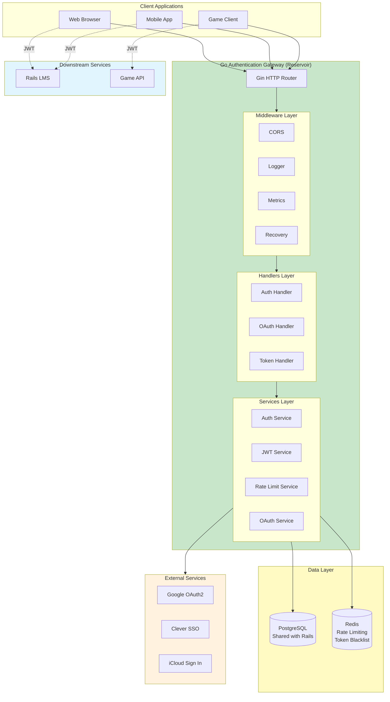

# Go Authentication Gateway Architecture

This document provides a comprehensive overview of the Go Authentication Gateway ("Reservoir") architecture, design decisions, and implementation details.

## System Overview

The Go Authentication Gateway is a standalone microservice that centralizes all authentication for the Boddle ecosystem (Rails LMS, game clients, mobile apps).

### High-Level Architecture



## Technology Stack

### Core Technologies

| Component | Technology | Version | Purpose |
|-----------|-----------|---------|---------|
| **Language** | Go | 1.22+ | High performance, type safety |
| **Web Framework** | Gin | 1.10+ | HTTP routing and middleware |
| **Database Driver** | lib/pq | 1.10+ | PostgreSQL connectivity |
| **Database ORM** | sqlx | 1.4+ | SQL query builder |
| **Redis Client** | go-redis | 9.5+ | Cache and rate limiting |
| **JWT Library** | golang-jwt/jwt | 5.2+ | Token generation/validation |
| **OAuth2** | golang.org/x/oauth2 | 0.18+ | OAuth2 flows |
| **Password Hashing** | golang.org/x/crypto | 0.21+ | bcrypt |
| **Config** | envconfig | 1.4+ | Environment variables |
| **Logging** | zap | 1.27+ | Structured logging |
| **Metrics** | Prometheus | 1.19+ | Observability |
| **Testing** | testify | 1.9+ | Test assertions |

### Why These Choices?

**Go**:
- Excellent performance (~2-3x faster than Rails for CPU-bound tasks)
- Built-in concurrency (goroutines)
- Static typing (fewer runtime errors)
- Fast compilation
- Small binary size (~20MB)
- Low memory footprint

**Gin**:
- Fastest Go web framework (based on httprouter)
- Rich middleware ecosystem
- Simple, idiomatic API
- Production-proven (used by many companies)

**PostgreSQL** (shared with Rails):
- Single source of truth
- No data synchronization needed
- Zero-downtime migration
- ACID transactions

**Redis**:
- In-memory speed (microsecond latency)
- Built-in TTL for automatic cleanup
- Atomic operations for rate limiting
- Pub/sub for real-time features (future)

## Project Structure

```
reservoir/
├── cmd/
│   └── server/
│       └── main.go                 # Entry point, dependency injection
│
├── internal/                       # Private application code
│   ├── auth/                       # Authentication logic
│   │   ├── handler.go              # HTTP handlers
│   │   ├── service.go              # Business logic
│   │   ├── password.go             # bcrypt operations
│   │   └── validator.go            # Input validation
│   │
│   ├── token/                      # JWT management
│   │   ├── jwt.go                  # JWT generation/validation
│   │   ├── claims.go               # JWT claims structure
│   │   └── blacklist.go            # Token revocation
│   │
│   ├── oauth/                      # OAuth providers
│   │   ├── google.go               # Google OAuth2
│   │   ├── clever.go               # Clever SSO
│   │   └── icloud.go               # iCloud Sign In
│   │
│   ├── user/                       # User management
│   │   ├── repository.go           # Database operations
│   │   ├── model.go                # User structs
│   │   └── mapper.go               # DB → Domain mapping
│   │
│   ├── ratelimit/                  # Rate limiting
│   │   ├── limiter.go              # Rate limit logic
│   │   └── login_attempt.go        # Failed attempt tracking
│   │
│   ├── middleware/                 # HTTP middleware
│   │   ├── cors.go                 # CORS headers
│   │   ├── logger.go               # Request logging
│   │   ├── recovery.go             # Panic recovery
│   │   ├── auth.go                 # JWT validation
│   │   └── metrics.go              # Prometheus metrics
│   │
│   ├── database/                   # Database connections
│   │   ├── postgres.go             # PostgreSQL pool
│   │   └── redis.go                # Redis client
│   │
│   └── config/                     # Configuration
│       └── config.go               # Environment variables
│
├── pkg/                            # Public libraries (reusable)
│   ├── errors/                     # Error types
│   │   └── errors.go               # Custom errors
│   └── response/                   # API responses
│       └── response.go             # Standard response format
│
├── tests/                          # Test files
│   ├── integration/                # Integration tests
│   └── mocks/                      # Mock implementations
│
├── .env.example                    # Example configuration
├── Dockerfile                      # Container image
├── docker-compose.yml              # Local development
├── Makefile                        # Build commands
└── go.mod                          # Go dependencies
```

### Layered Architecture

```
┌─────────────────────────────────────┐
│         HTTP Layer (Gin)            │  ← Routing, middleware
├─────────────────────────────────────┤
│      Handlers (HTTP Logic)          │  ← Request/response handling
├─────────────────────────────────────┤
│    Services (Business Logic)        │  ← Authentication, JWT, OAuth
├─────────────────────────────────────┤
│   Repositories (Data Access)        │  ← Database queries
├─────────────────────────────────────┤
│    Models (Domain Objects)          │  ← User, Token, etc.
└─────────────────────────────────────┘
```

**Benefits**:
- **Separation of concerns**: Each layer has single responsibility
- **Testability**: Easy to mock dependencies
- **Maintainability**: Changes isolated to specific layers
- **Reusability**: Services can be used by multiple handlers

## Core Components

### 1. Authentication Service

**Purpose**: Verify credentials and generate JWTs

**Responsibilities**:
- Email/password verification (bcrypt)
- Student username format handling
- User lookup in database
- Password validation
- JWT generation after successful auth

**Key Methods**:
```go
type AuthService interface {
    Login(email, password string) (*User, string, error)
    Logout(tokenID string) error
    VerifyPassword(digest, password string) bool
    ValidateEmail(email string) error
}
```

**Implementation**:
```go
func (s *AuthService) Login(email, password string) (*User, string, error) {
    // Normalize email
    email = strings.ToLower(strings.TrimSpace(email))

    // Check rate limiting
    if s.rateLimiter.IsBlocked(ip, email) {
        return nil, "", ErrRateLimited
    }

    // Find user
    user, err := s.userRepo.FindByEmail(email)
    if err != nil {
        s.rateLimiter.RecordAttempt(ip, email)
        return nil, "", ErrInvalidCredentials
    }

    // Verify password
    if !s.VerifyPassword(user.PasswordDigest, password) {
        s.rateLimiter.RecordAttempt(ip, email)
        return nil, "", ErrInvalidCredentials
    }

    // Update last login
    s.userRepo.UpdateLastLoggedOn(user.ID)

    // Generate JWT
    token, err := s.jwtService.Generate(JWTClaims{
        UserID:    user.ID,
        BoddleUID: user.BoddleUID,
        Email:     user.Email,
        MetaType:  user.MetaType,
        MetaID:    user.MetaID,
    })

    return user, token, nil
}
```

---

### 2. JWT Service

**Purpose**: Generate and validate JWT tokens

**JWT Structure**:
```json
{
  "alg": "HS256",
  "typ": "JWT"
}
{
  "user_id": 123,
  "boddle_uid": "uuid-v4-here",
  "email": "user@example.com",
  "name": "John Doe",
  "meta_type": "Teacher",
  "meta_id": 456,
  "iss": "reservoir",
  "sub": "123",
  "aud": ["lms", "game"],
  "exp": 1710518400,
  "nbf": 1710496800,
  "iat": 1710496800,
  "jti": "unique-token-id"
}
```

**Key Methods**:
```go
type JWTService interface {
    Generate(claims JWTClaims) (string, error)
    Validate(token string) (*JWTClaims, error)
    IsBlacklisted(tokenID string) (bool, error)
}
```

**Implementation**:
```go
func (s *JWTService) Generate(claims JWTClaims) (string, error) {
    now := time.Now()
    jti := uuid.New().String()

    standardClaims := jwt.RegisteredClaims{
        Issuer:    s.config.Issuer,
        Subject:   strconv.Itoa(claims.UserID),
        Audience:  s.config.Audience,
        ExpiresAt: jwt.NewNumericDate(now.Add(s.config.AccessTokenTTL)),
        NotBefore: jwt.NewNumericDate(now),
        IssuedAt:  jwt.NewNumericDate(now),
        ID:        jti,
    }

    token := jwt.NewWithClaims(jwt.SigningMethodHS256, jwt.MapClaims{
        "user_id":     claims.UserID,
        "boddle_uid":  claims.BoddleUID,
        "email":       claims.Email,
        "name":        claims.Name,
        "meta_type":   claims.MetaType,
        "meta_id":     claims.MetaID,
        "iss":         standardClaims.Issuer,
        "sub":         standardClaims.Subject,
        "aud":         standardClaims.Audience,
        "exp":         standardClaims.ExpiresAt.Unix(),
        "nbf":         standardClaims.NotBefore.Unix(),
        "iat":         standardClaims.IssuedAt.Unix(),
        "jti":         standardClaims.ID,
    })

    return token.SignedString([]byte(s.config.SecretKey))
}

func (s *JWTService) Validate(tokenString string) (*JWTClaims, error) {
    token, err := jwt.Parse(tokenString, func(token *jwt.Token) (interface{}, error) {
        if _, ok := token.Method.(*jwt.SigningMethodHMAC); !ok {
            return nil, ErrInvalidSigningMethod
        }
        return []byte(s.config.SecretKey), nil
    })

    if err != nil {
        return nil, err
    }

    if !token.Valid {
        return nil, ErrInvalidToken
    }

    claims := token.Claims.(jwt.MapClaims)

    // Check blacklist
    jti := claims["jti"].(string)
    if blacklisted, _ := s.IsBlacklisted(jti); blacklisted {
        return nil, ErrTokenRevoked
    }

    return &JWTClaims{
        UserID:    int(claims["user_id"].(float64)),
        BoddleUID: claims["boddle_uid"].(string),
        Email:     claims["email"].(string),
        Name:      claims["name"].(string),
        MetaType:  claims["meta_type"].(string),
        MetaID:    int(claims["meta_id"].(float64)),
    }, nil
}
```

---

### 3. Rate Limiter

**Purpose**: Prevent brute-force attacks

**Algorithm**: Sliding window with Redis

**Implementation**:
```go
type RateLimiter struct {
    redis  *redis.Client
    config RateLimitConfig
}

func (r *RateLimiter) IsBlocked(ip, email string) (bool, int, error) {
    key := fmt.Sprintf("ratelimit:login:%s:%s", ip, email)

    // Increment counter
    count, err := r.redis.Incr(context.Background(), key).Result()
    if err != nil {
        return false, 0, err
    }

    // Set expiry on first attempt
    if count == 1 {
        r.redis.Expire(context.Background(), key, r.config.Window)
    }

    // Check if blocked
    if count > r.config.MaxAttempts {
        // Get TTL for remaining lockout time
        ttl, _ := r.redis.TTL(context.Background(), key).Result()
        return true, int(ttl.Seconds()), nil
    }

    return false, 0, nil
}

func (r *RateLimiter) RecordAttempt(ip, email string) error {
    // Also record in PostgreSQL for audit trail
    return r.db.Exec(`
        INSERT INTO login_attempts (ip_address, email, created_at)
        VALUES ($1, $2, NOW())
    `, ip, email)
}
```

**Configuration**:
```go
type RateLimitConfig struct {
    MaxAttempts int           // 5
    Window      time.Duration // 10 minutes
    Lockout     time.Duration // 15 minutes
}
```

---

### 4. User Repository

**Purpose**: Database operations for users

**Interface**:
```go
type UserRepository interface {
    FindByEmail(email string) (*User, error)
    FindByID(id int) (*User, error)
    FindByBoddleUID(uid string) (*User, error)
    UpdateLastLoggedOn(id int) error
    CreateUser(user *User) error

    // OAuth-related
    FindByGoogleUID(uid string) (*User, error)
    FindByCleverUID(uid string) (*User, error)
    FindByiCloudUID(uid string) (*User, error)
    LinkOAuthAccount(userID int, provider string, uid string) error
}
```

**Implementation** (using sqlx):
```go
func (r *UserRepository) FindByEmail(email string) (*User, error) {
    var user User

    query := `
        SELECT id, email, name, password_digest, boddle_uid,
               meta_type, meta_id, last_logged_on, timezone,
               created_at, updated_at
        FROM users
        WHERE LOWER(email) = LOWER($1)
    `

    err := r.db.Get(&user, query, email)
    if err == sql.ErrNoRows {
        return nil, ErrUserNotFound
    }
    if err != nil {
        return nil, err
    }

    return &user, nil
}

func (r *UserRepository) FindByGoogleUID(uid string) (*User, error) {
    var user User

    query := `
        SELECT u.id, u.email, u.name, u.password_digest, u.boddle_uid,
               u.meta_type, u.meta_id, u.last_logged_on
        FROM users u
        INNER JOIN teachers t ON u.meta_id = t.id AND u.meta_type = 'Teacher'
        WHERE t.google_uid = $1

        UNION

        SELECT u.id, u.email, u.name, u.password_digest, u.boddle_uid,
               u.meta_type, u.meta_id, u.last_logged_on
        FROM users u
        INNER JOIN students s ON u.meta_id = s.id AND u.meta_type = 'Student'
        WHERE s.google_uid = $1

        UNION

        SELECT u.id, u.email, u.name, u.password_digest, u.boddle_uid,
               u.meta_type, u.meta_id, u.last_logged_on
        FROM users u
        INNER JOIN parents p ON u.meta_id = p.id AND u.meta_type = 'Parent'
        WHERE p.google_uid = $1
    `

    err := r.db.Get(&user, query, uid)
    if err == sql.ErrNoRows {
        return nil, ErrUserNotFound
    }
    if err != nil {
        return nil, err
    }

    return &user, nil
}
```

---

### 5. OAuth Service

**Purpose**: Handle OAuth2 flows (Google, Clever, iCloud)

**Interface**:
```go
type OAuthService interface {
    GetAuthorizationURL(provider string, state string) (string, error)
    HandleCallback(provider string, code string, state string) (*User, string, error)
    ExchangeCode(provider string, code string) (*oauth2.Token, error)
    GetUserInfo(provider string, token *oauth2.Token) (*OAuthUserInfo, error)
}
```

**Google OAuth Implementation**:
```go
func (s *OAuthService) HandleGoogleCallback(code, state string) (*User, string, error) {
    // Verify state (CSRF protection)
    if !s.redis.Exists(ctx, fmt.Sprintf("oauth:state:%s", state)) {
        return nil, "", ErrInvalidOAuthState
    }
    s.redis.Del(ctx, fmt.Sprintf("oauth:state:%s", state))

    // Exchange code for token
    token, err := s.googleConfig.Exchange(ctx, code)
    if err != nil {
        return nil, "", err
    }

    // Get user info
    client := s.googleConfig.Client(ctx, token)
    resp, err := client.Get("https://www.googleapis.com/oauth2/v2/userinfo")
    if err != nil {
        return nil, "", err
    }
    defer resp.Body.Close()

    var userInfo struct {
        Sub     string `json:"sub"`      // Google UID
        Email   string `json:"email"`
        Name    string `json:"name"`
        Picture string `json:"picture"`
    }
    json.NewDecoder(resp.Body).Decode(&userInfo)

    // Find or create user
    user, err := s.userRepo.FindByGoogleUID(userInfo.Sub)
    if err == ErrUserNotFound {
        // Try email match
        user, err = s.userRepo.FindByEmail(userInfo.Email)
        if err == ErrUserNotFound {
            // Create new user
            user, err = s.createUserFromGoogle(userInfo)
        } else {
            // Link Google account
            s.userRepo.LinkOAuthAccount(user.ID, "google", userInfo.Sub)
        }
    }

    // Generate JWT
    jwt, err := s.jwtService.Generate(JWTClaims{
        UserID:    user.ID,
        BoddleUID: user.BoddleUID,
        Email:     user.Email,
        MetaType:  user.MetaType,
        MetaID:    user.MetaID,
    })

    return user, jwt, nil
}
```

---

## API Endpoints

### Authentication Endpoints

| Method | Endpoint | Description | Auth Required |
|--------|----------|-------------|---------------|
| POST | `/auth/login` | Email/password login | No |
| POST | `/auth/logout` | Revoke token | Yes (JWT) |
| POST | `/auth/refresh` | Refresh access token | No (refresh token) |
| GET | `/auth/me` | Get current user | Yes (JWT) |

### OAuth Endpoints

| Method | Endpoint | Description |
|--------|----------|-------------|
| GET | `/auth/google` | Initiate Google OAuth |
| GET | `/auth/google/callback` | Google OAuth callback |
| GET | `/auth/clever` | Initiate Clever SSO |
| GET | `/auth/clever/callback` | Clever SSO callback |
| GET | `/auth/icloud` | Initiate iCloud Sign In |
| POST | `/auth/icloud/callback` | iCloud callback |

### Login Token Endpoints

| Method | Endpoint | Description |
|--------|----------|-------------|
| GET | `/auth/token` | Authenticate with login token |

### Internal Endpoints

| Method | Endpoint | Description | Auth Required |
|--------|----------|-------------|---------------|
| POST | `/internal/issue-jwt` | Issue JWT for Rails migration | Yes (internal token) |
| GET | `/health` | Health check | No |
| GET | `/metrics` | Prometheus metrics | No |

---

## Configuration

### Environment Variables

```bash
# Server Configuration
PORT=8080
ENV=production                    # development, staging, production
LOG_LEVEL=info                    # debug, info, warn, error

# Database (PostgreSQL)
DB_HOST=localhost
DB_PORT=5432
DB_USER=boddle
DB_PASSWORD=<secret>
DB_NAME=lmsprod
DB_SSL_MODE=require               # disable, require, verify-ca, verify-full
DB_MAX_CONNS=50                   # Connection pool size

# Redis
REDIS_URL=redis://localhost:6379/0
REDIS_PASSWORD=<secret>
REDIS_MAX_IDLE=10
REDIS_MAX_ACTIVE=50

# JWT Configuration
JWT_SECRET_KEY=<64-char-hex>              # MUST match Rails
JWT_REFRESH_SECRET_KEY=<64-char-hex>     # Different from access token secret
JWT_ISSUER=reservoir
JWT_AUDIENCE=lms,game
JWT_ACCESS_TOKEN_TTL=6h           # 6 hours (matches Rails session)
JWT_REFRESH_TOKEN_TTL=720h        # 30 days

# Google OAuth2
GOOGLE_CLIENT_ID=<client-id>.apps.googleusercontent.com
GOOGLE_CLIENT_SECRET=<secret>
GOOGLE_REDIRECT_URL=https://auth.boddle.com/auth/google/callback

# Clever SSO
CLEVER_CLIENT_ID=<client-id>
CLEVER_CLIENT_SECRET=<secret>
CLEVER_REDIRECT_URL=https://auth.boddle.com/auth/clever/callback

# iCloud Sign In
ICLOUD_SERVICE_ID=com.boddle.auth
ICLOUD_TEAM_ID=<team-id>
ICLOUD_KEY_ID=<key-id>
ICLOUD_PRIVATE_KEY_PATH=/secrets/icloud_private_key.p8
ICLOUD_REDIRECT_URL=https://auth.boddle.com/auth/icloud/callback

# Rate Limiting
RATE_LIMIT_LOGIN_MAX_ATTEMPTS=5
RATE_LIMIT_LOGIN_WINDOW=10m
RATE_LIMIT_LOGIN_LOCKOUT=15m

# CORS
CORS_ALLOWED_ORIGINS=https://lms.boddle.com,https://app.boddle.com,https://game.boddle.com

# Monitoring
PROMETHEUS_ENABLED=true
SENTRY_DSN=<sentry-dsn>

# Internal API
AUTH_GATEWAY_INTERNAL_TOKEN=<shared-secret>  # For Rails→Go communication
```

### Configuration Loading

```go
// internal/config/config.go
type Config struct {
    Server    ServerConfig
    Database  DatabaseConfig
    Redis     RedisConfig
    JWT       JWTConfig
    OAuth     OAuthConfig
    RateLimit RateLimitConfig
    CORS      CORSConfig
}

func Load() (*Config, error) {
    // Load .env file (optional, for development)
    godotenv.Load()

    var cfg Config
    if err := envconfig.Process("", &cfg); err != nil {
        return nil, fmt.Errorf("failed to load config: %w", err)
    }

    // Validate configuration
    if err := cfg.Validate(); err != nil {
        return nil, fmt.Errorf("invalid config: %w", err)
    }

    return &cfg, nil
}
```

---

## Deployment

### Docker

**Build**:
```bash
docker build -t boddle/reservoir:v1.0.0 .
```

**Run**:
```bash
docker run -d \
    --name reservoir \
    -p 8080:8080 \
    --env-file .env \
    boddle/reservoir:v1.0.0
```

### Kubernetes

**Deployment**:
```yaml
apiVersion: apps/v1
kind: Deployment
metadata:
  name: reservoir
spec:
  replicas: 3
  selector:
    matchLabels:
      app: reservoir
  template:
    spec:
      containers:
      - name: reservoir
        image: boddle/reservoir:v1.0.0
        ports:
        - containerPort: 8080
        envFrom:
        - secretRef:
            name: reservoir-secrets
        resources:
          requests:
            memory: "256Mi"
            cpu: "500m"
          limits:
            memory: "512Mi"
            cpu: "1000m"
        livenessProbe:
          httpGet:
            path: /health
            port: 8080
          initialDelaySeconds: 10
          periodSeconds: 10
        readinessProbe:
          httpGet:
            path: /health
            port: 8080
          initialDelaySeconds: 5
          periodSeconds: 5
```

### Monitoring

**Prometheus Metrics**:
- `auth_login_attempts_total` - Counter (by status: success/failure/blocked)
- `auth_login_duration_seconds` - Histogram (by method: email/google/clever)
- `auth_jwt_generated_total` - Counter
- `auth_jwt_validated_total` - Counter (by result: valid/invalid/expired)
- `auth_rate_limit_hits_total` - Counter

**Grafana Dashboard**: See `docs/monitoring/grafana-dashboard.json`

---

## Security Considerations

### JWT Secret Management

**Generation**:
```bash
openssl rand -hex 64
```

**Storage**:
- Development: `.env` file
- Production: Kubernetes Secrets / AWS Secrets Manager / Vault

**Rotation**:
1. Generate new secret
2. Deploy Go Gateway with both old and new secrets
3. Deploy Rails with both secrets
4. Wait for all old tokens to expire (6 hours)
5. Remove old secret

### Password Security

- **Algorithm**: bcrypt
- **Cost Factor**: 10 (2^10 = 1024 iterations)
- **Salt**: Generated automatically by bcrypt
- **Timing Attack Protection**: bcrypt.CompareHashAndPassword is constant-time

### Rate Limiting

- **By IP + Email**: Prevents distributed attacks
- **Redis-backed**: Fast, distributed rate limiting
- **Automatic cleanup**: TTL removes old entries

### Token Revocation

- **Blacklist in Redis**: Fast lookup
- **TTL**: Only store until natural expiry
- **Admin override**: Can revoke all user tokens

---

## Performance Benchmarks

### Expected Performance

| Operation | Latency (p50) | Latency (p99) | Throughput |
|-----------|---------------|---------------|------------|
| Login (email/password) | 30ms | 50ms | 1000 req/s |
| JWT validation | 1ms | 2ms | 50000 req/s |
| OAuth callback | 200ms | 500ms | 500 req/s |
| Token refresh | 10ms | 20ms | 5000 req/s |
| Rate limit check | 1ms | 2ms | 100000 req/s |

### Load Testing

**Tool**: k6

```javascript
import http from 'k6/http';
import { check } from 'k6';

export let options = {
  stages: [
    { duration: '2m', target: 100 },
    { duration: '5m', target: 100 },
    { duration: '2m', target: 200 },
    { duration: '5m', target: 200 },
    { duration: '2m', target: 0 },
  ],
};

export default function () {
  let res = http.post('http://localhost:8080/auth/login', JSON.stringify({
    email: 'test@example.com',
    password: 'TestPassword123',
  }), {
    headers: { 'Content-Type': 'application/json' },
  });

  check(res, {
    'status is 200': (r) => r.status === 200,
    'has token': (r) => r.json('token') !== undefined,
  });
}
```

Run: `k6 run load-test.js`

---

## Summary

The Go Authentication Gateway provides:

1. **Centralized Authentication**: Single service for all auth methods
2. **High Performance**: ~5x faster than Rails for auth operations
3. **Horizontal Scalability**: Stateless JWT architecture
4. **Security**: Rate limiting, token revocation, bcrypt
5. **Observability**: Prometheus metrics, structured logging
6. **Maintainability**: Clean architecture, well-tested
7. **Flexibility**: Supports web, mobile, game clients

Next: See [Implementation Plan](../../README.md) for detailed development timeline.
